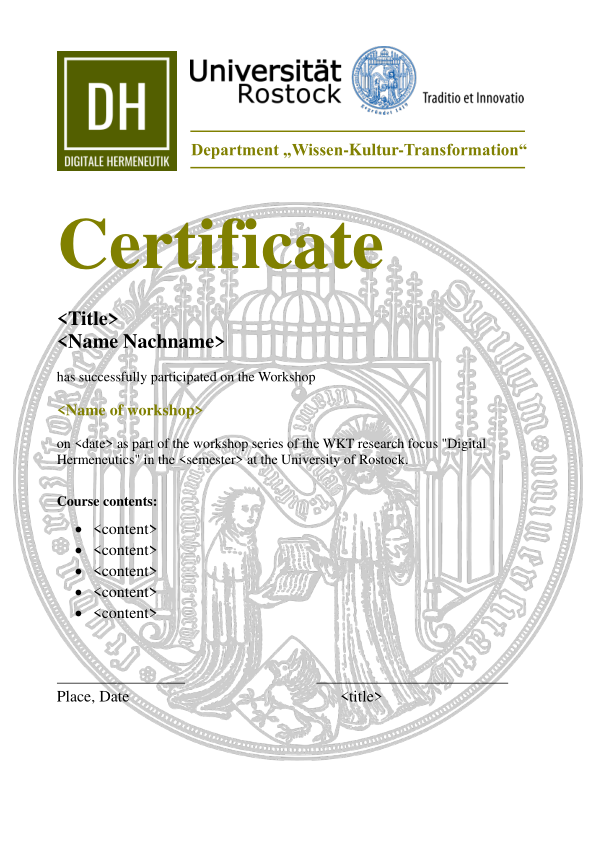

# Automatisierte Zertifikate
Dieses Tool kann zur automatischen Erstellung von Zertifikate im Rahmen von Workshops des Forschungsschwerpunkts Digitale Hermeneutik verwendet werden.

## So funktionert es

CertificateGen.py nimmt Informationen aus verschiedenen Quellen auf, um das Zertifikat zusammenzustellen. 
- Der stabile Text (der sich unabhängig vom Workshop nicht ändert) wird je nach Sprache entweder aus de_text.json oder en_json extrahiert.
- Der variable Text wird aus einer workshopabhängigen Datei extrahiert, die für jedes neue Zertifikatsmodell erstellt werden muss (zum Beispiel: 202305_CoolTool_description).
- Die Namen der Teilnehmer sowie ihre akademischen TitDie oben genannten Daten sind nicht "hard coded" im Tool. Das heißt, dass der Speicherort der Eingabedaten immer in einer config.yaml-Datei definiert werden muss.el und Abschlüsse werden aus einer .csv-Datei entnommen, die ebenfalls für jedes neue Zertifikatsmodell erstellt werden muss (aus Datenschutzgründen ist diese Datei nicht im Repository enthalten).
- Außerdem wird die Unterschrift des Verantwortlichen für die Unterzeichnung des Dokuments verwendet (diese wird aus Datenschutzgründen nicht in das Repository aufgenommen).
- Schließlich wird auch das Hintergrundlayout des Zertifikats vom Tool verwendet (WKT_Certificate-01.png).

Die oben genannten Daten sind nicht "hard coded" im Tool. Das heißt, dass der Speicherort der Eingabedaten immer in einer config.yaml-Datei definiert werden muss.

## Standards for the input files

### Variable Text
Diese Datei enthält Informationen zu dem Workshop oder der Veranstaltung, auf die sich das Zertifikat bezieht.

Wir schlagen den folgenden Namensstandard für die Datei vor:

{Year}{Month}_{NamedesWorkshops}_description.json

z.B.: 202311_OCR4all_description.json

- course_title: vollständiger Titel des Workshops
- course_contents: Liste der Inhalte des Workshops. Hier ist es sinnvoll, sich auf Inhalte zu konzentrieren, die für ein Zertifikat relevant sind, z.B. bestimmte Software, Methoden oder erlernte Fähigkeiten. Der Inhalt sollte in eckige Klammern gesetzt werden; jeder einzelne Punkt sollte in Anführungszeichen gesetzt und durch Kommata voneinander getrennt werden.
- date_begin: Datum des ersten Tages des Workshops. Den ISO-Standard verwenden, d.h. 'JJJJ-MM-TT'.
- date_end: Datum des letzten Tages des Workshops. Wenn der Workshop an einem Tag war, sind das Anfangs- und das Enddatum identisch. Den ISO-Standard verwenden, d.h. 'JJJJ-MM-TT'.
- place: Die Stadt, in der der Workshop stattfindet, oder der Veranstalter, wenn online.
- semester: Winter- oder Sommersemester.

```
{
    "course_title": "Erschließung gedruckter und handschriftlicher Textzeugen mit OCR4all",
    "course_contents": [
        "Allgemeine Einführung in die automatische Texterkennung",
        "Einführung in Transkription und Transkriptionsrichtlinien",
        "Einführung in LAREX",
        "Vorstellung der neuen OCR4all-Version"
    ],
    "date_begin": "2023-11-23",
    "date_end": "2023-11-23",
    "place": "Rostock",
    "semester": "Wintersemester"
}
```

### Liste der Teilnehmer

Alle Teilnehmer sollten in einer .csv-Datei mit zwei Spalten aufgelistet werden, eine Spalte ("Name") mit dem vollständigen Namen des Teilnehmers und eine ("Title") mit dem akademischen Titel oder Abschluss. Wenn der Teilnehmer keinen Abschluss hat, sollte der Wert "nd" angegeben werden.

Wir schlagen den folgenden Namensstandard für die Datei vor:

{Year}{Month}_{NamedesWorkshops}_participants.csv

z.B.: 202311_OCR4all_participants.csv

| Name | Title |
| ------------- | ------------- |
| Jane Doe | Prof.Dr.  |
| John Doe  | M.A.  |
| Joseph Adams  | nd  |
| Mufasa Löwe  | B.Sc.  |

### Signature

Die Unterschriftsdaten sollten ein .png Bild mit hoher Auflösung der Unterschrift sein. Die Datei sollte im Ordner Media gespeichert werden.

### config.yaml

- workshopid: Kurzbezeichnung des Workshops. Sollte dem Namen entsprechen, der in den Dateien (...)description.json und (...) participants.csv angegeben ist. Wir empfehlen folgenden Standard: {Year}{Month}_{NamedesWorkshops}
- language: en für Englisch und de für Deutsch.
- signature: Name der png-Datei mit der Unterschrift.
- ignoretitles: Liste der Titel/Abschluss, die in den Zertifikaten ignoriert werden sollen. Wenn zum Beispiel keine B.A.-Abschluss ausgedruckt werden sollen, sollte die Liste wie folgt aussehen: ["nd", "B.A."]. Wenn alle Titel und Abschlüsse gedruckt werden sollen, sollte der Wert lauten: ["nd"].

```
workshopid: 202311_OCR4all
language: de
signature: FAF.png
ignoretitles: ["nd"]
```

